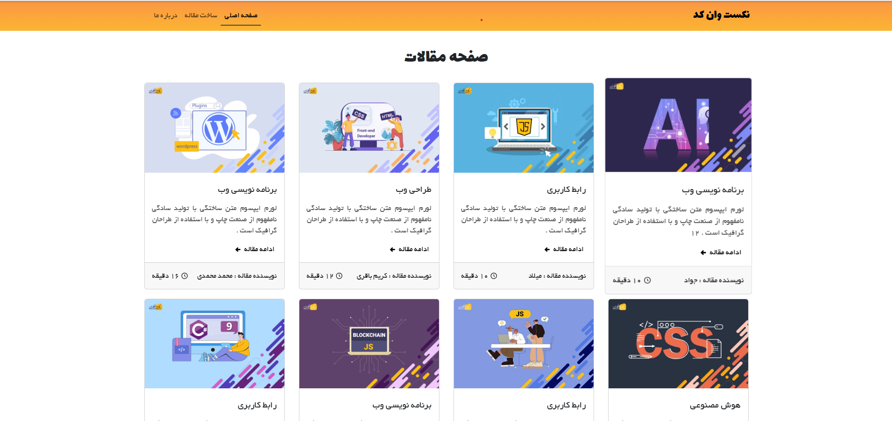
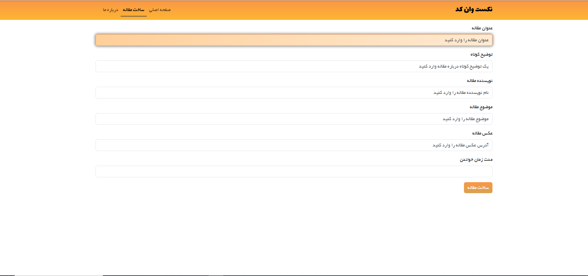
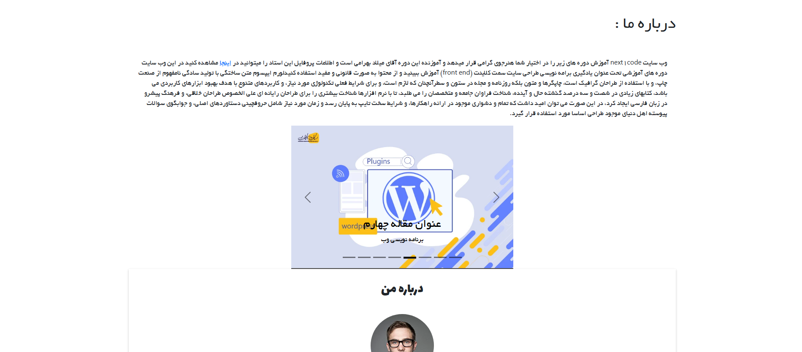

# next1code-articles

## similar project to next1code articles

### how to run a project :

for run the project enter the following commands in the terminal

1. running the react app :

```cmd 
  npm start
  ```
2. running the data base : 

```cmd 
npx json-server -w db.json -p 4000
```
- make sure to run the database on port 4000 for it to work properly

---

### Features 

- ⭐ full responsive

- ⭐ api base

- ⭐ good UI & UX

---

### home page :




---

### add article page : 



---

### about page : 


